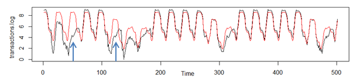

## Le paiement du stationnement à Paris, analyse exploratoire... et impact de la météo?

Depuis quelques années, la mairie de Paris a mis en ligne une [plateforme de publication d’open data] (http://opendata.paris.fr/). Plusieurs centaines de jeux de données y sont présentés sur des thématiques aussi diverses que la fiscalité, les espaces verts en passant par le logement ou les scores électoraux ; certains jeux disposant d’une géolocalisation de leurs mesures. La présente note s’emploie à analyser l’un de ces jeux de données, assez méconnu et pas encore exploité à notre connaissance : les [données de paiements des horodateurs parisiens](http://opendata.paris.fr/explore/dataset/horodateurs-transactions-de-paiement/information) (données sous licence ODbL). 

Comme souvent dans l’open data, l’analyse de données permet au statisticien d’analyser certains phénomènes et comportements humains au moyen d’informations indirectes et/ou recoupées. A travers le paiement du stationnement de leurs véhicules, les parisiens nous renseignent sur leurs habitudes, leurs horaires de travail, mais également l’existence éventuelle de stratégies de paiement liées aux contraintes du stationnement.

Nous avons essayé de recouper les données avec une source externe, **la météo qui sera testée comme facteur influençant le paiement**. Cette dernière source est fournie par la start-up [METIGATE](http://metigate.com/) qui propose des services dans la modélisation statistique de la météo.

## Insights sur les données

La présentation suivante donne un aperçu, et on retrouve l'ensemble des analyse et des graphiques dans le document complet [**note de synthèse**] (https://gitlab.com/agenis/parcmetres/raw/master/Note.de.synthese.pdf)

La Mairie de Paris fournit un jeu de données propres de *24 millions d'enregistrements* sur l'ensemble de l'année **2014**, soit *7922 parcmètres*, certains ayant été installés en cours d'année.
Cela nous donne un total de *62.4 millions d'euros* collectés, répartis entre le stationnemnet résidentiel (pour les parisiens) et le stationnement rotatif (courte durée, plus onéreux)

Ces paiements sont très inégaux selon l'heure, l'arrondissement, et le mode de paiement; certains parcmètres étant de véritables machines à sous, alors que d'autres sont carrément boudés par les usagers, pour diverses raisons (voir le palmarès avec quelques photos dans la note):
le top1, situé rue du départ à Montparnasse, fait 10 transactions à l'heure en journée et rapporte  90 000€ par an.

Il est intéressant de se représenter la dynamique d'utilisation au fil de la journée, avec les pics correspondants aux moments d'importants déplacements en voiture. La comparaison avec le montant moyen payé permet de déceler certains comportements amusants, comme le "regarage de voiture" à 7h du matin. Mais on peut égalemnet représenter toutes ces données en dynamique, à l'échelle d'une journée moyenne, selon le type d'usager, et on voit bien les zones hyper "business" qui s'éteignent en dernier le soir.... Ca donne ça (laissez charger un peu l'image est lourde):

## Et la météo là-dedans?

Ce qu'on aurait vraiment aimé faire, c'est avoir une grille météo couvrant tout Paris et matcher ces données à la fois aux paiements des horodateurs et a des données de contraventions de stationnemnet (qui sont malheureusement impossibles à trouver, j'ai fait du ping pong entre les différentes administrations snas succès...). Mais on voit déjà des choses intéressantes sur une seule station à Montsouris (qui représente Paris pour l'occasion). Ce sont les précipitations qui nous intéressent, en fait, elles sont réparties ainsi dans l'année (pas de neige en 2014, d'ailleurs?)

On a eu en 2017 à Montsouris pas moins que 693mm tombés (ce qui est normal)! On va alors essayer de représenter chaque jour de l'année avec le revenu de chaque parcmètre, et l'information sur la pluie. On a supprimé les samedis et dimanches pour éviter le "clignotement" désagréable:

Tout ceci est bien, mais comment quantifier l'impact de la météo? Pour éviter le suspense voici le résultat: il est très **faible, mais certain sur la baisse des paiements**. La pluie a été testée dans un modèle linéaire modifié où on a pris la racine carrée du nombre de transactions pour chaque heure de l'année, sur l'ensemble de Paris. La précipitation étant un phénomène qui bouge dans l'espace, il est logique qu'on trouve une influence plus forte lorsqu'on applique certaines transformations à la variable telles que: 
- garder seulement les pluies plus longues que 1h
- étaler la pluie 2H avant et 2H après la mesure à Montsouris

Lorsqu'on met tout cela dans un modèle multivarié, avec interactions entre les heures de la journée, le week-end, et même le mois d'août semi-gratuit, on arrive assez bien à prédire la cagnotte:

Les petites flèches bleues montrent justemnet que le modèle n'est pas tout à fait exact certains jours, et j'avoue avoir mis beaucoup de temps avant de me rendre compte que ces jours particuliers correspondaient aux arrêtés préfectoraux de pics de pollution et gratuité du stationnemnet résidentiel (qui a un effet induit sur le stationnement rotatif).

## Mais beaucoup d'autres choses peuvent expliquer...

Oui, si un modèle calendaire/météo arrive bien à prédire les recettes globales, il en va bien autrement si on veut prédire la performance de chaque équipemenet individuel (R² de quelques % au mieux), a fortiori dans le temps. En première approche, on va utiliser un modèle linéaire dit "à dépendance spatial" pour modéliser les corrélations spatiales qui sont sous-jacentes aux différentes zones de Paris. 

La travail est complexe puisqu'il faut définir une mesure de distance (et ne pas oublier que les coordonnées GPS doivent être converties de façon siouxe en km). On produit alors une matrice de voisinage qui relie chaque parcmètre à ses plus proches voisins. Combien de voisins? il faut encore optimiser.. 

Afin d'éviter le jargon statistique on conclut au final que la diversité des parcmètres s'explique par de fortes spécificités locales, et que c'était bien la peine de calculer un multiplicateur de Lagrange pour arriver à cette conclusion aussi... evidente!

## Conclusion

L’analyse des transactions d’horodateurs s’est révélée une tâche délicate par la complexité même des modes de paiement et d’utilisation des horodateurs. Une fois ces mécanismes décortiqués et pris en compte, on peut faire émerger des conclusions intéressantes sur les  patterns d’utilisation, les habitudes des parisiens ou les mouvements pendulaires au cours de la journée, ou encore la concentration des quartiers « chauds » ou « calmes » en termes de stationnement. En tout cas j'ai pris un grand plaisir à faire ces analyses; les données contiennent encore plein d'information cachée, c'est certain, mais je passe la main au suivant!

## Licence

Le code est sous licence GNU

## Auteur

marc.agenis@gmail.com

Merci à Yann Amice pour les encouragements et les données météo dans cette collaboration avec: 

